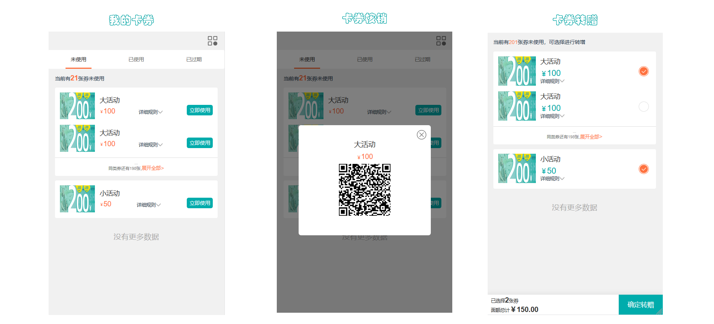
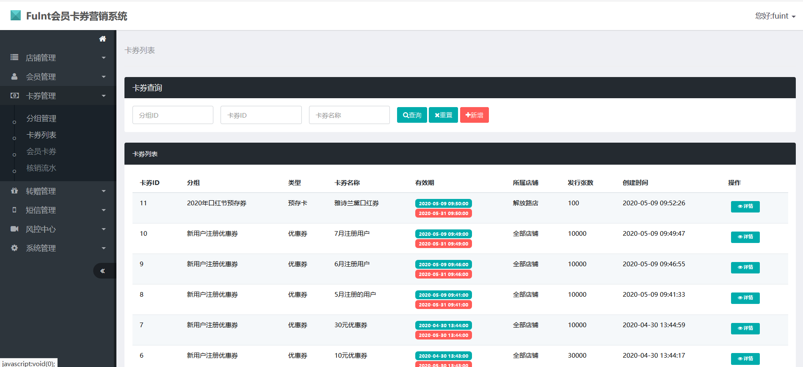
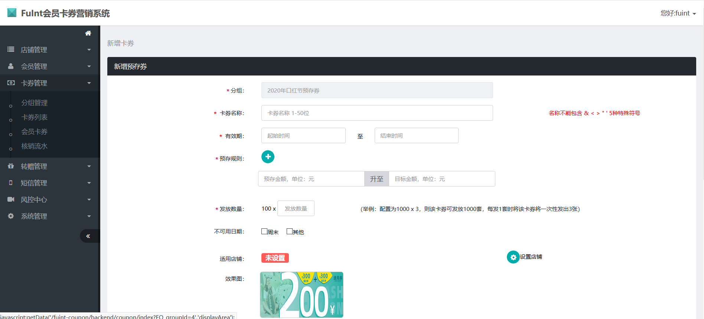

# FuInt会员卡券系统介绍

#### 介绍
欢迎使用FuInt会员卡券系统。本项目包含优惠券、预存卡、集次卡、短信发送、储值卡、消费券等会员营销功能，支持批量操作。源码完整，包含前台h5、后端api、后台管理三部分。本系统适用于各类实体店铺，如酒店、汽车4S店、鲜花店、甜品店、餐饮店等，
也适用于线上的电商系统，有独立的接入api，建议咨询下方的微信，以便提供更完善的功能。
以下是h5的页面展示：

#### 软件架构
JAVA（springMvc+mybatis） + MYSQL + Redis

#### 安装步骤

1.  导入数据库
2.  修改配置文件
3.  将工程打包，然后把war包放入tomcat中

#### 前台使用说明

1.  会员登录，登录成功后可看到会员的卡券列表。
2.  卡券领取和购买，预存券的充值等。
3.  核销卡券，会员在前台出示二维码，管理员用微信扫一扫即可核销。
4.  卡券转赠，会员可将自己的卡券转赠给其他用户，输入对方的手机号即可完成转赠，获赠的好友会收到卡券赠送的短信。

#### 后台使用
1.  会员管理：会员新增、导入、禁用等。
2.  卡券管理：电子券管理为2层结构，即电子券组和电子券。
3.  会员积分：会员积分管理，会员积分的操作，会员积分明细查看。
4.  转赠管理：卡券转赠记录。
5.  短信管理：短信营销功能，已发送的短信列表。
6.  系统配置：配置系统管理员权限等。
7.  店铺管理：支持多店铺模式。
8.  核销管理员:核销人员管理主要包含3个功能：核销人员列表、核销人员审核、核销人员信息编辑。
9.  短信模板管理：可配置不同场景和业务的短信内容。
10. 卡券发放：单独发放、批量发放，发放成功后给会员发送短信通知
11. 操作日志主要针对电子券系统后台的一些关键操作进行日志记录，方便排查相关操作人的行为等问题。
12. 发券记录主要根据发券的实际操作情况来记录，分为单用户发券和批量发券，同时可针对该次发券记录进行作废操作。

#### 后续功能迭代

1.  报表统计
2.  微信卡券接入
3.  会员扩展

不足和待完善之处请谅解！源码仅供学习交流，如需二次开发或更多功能，可联系我们wx：fsq_better。

