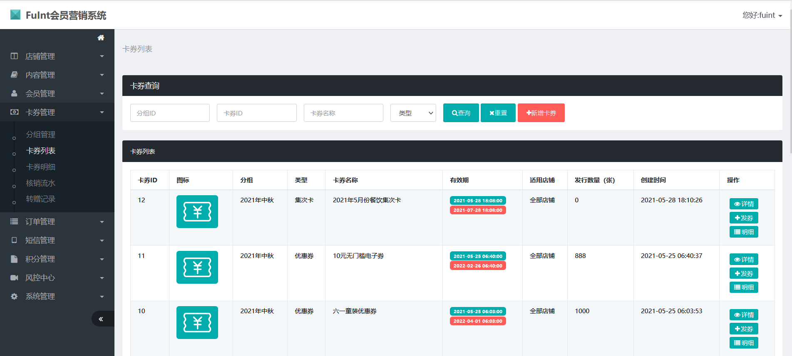

# fuint会员卡券系统介绍

#### 介绍
欢迎使用FuInt会员卡券系统，您的优惠券、预存券、红包等卡券大管家！ 以下是h5的页面展示：

#### 软件架构
JAVA + MYSQL

#### 安装步骤

1.  导入数据库
2.  修改配置文件
3.  将工程打包，然后把war包放入tomcat中

#### 前台使用说明

1.  会员登录，登录成功后可看到会员的卡券列表。
2.  卡券领取和购买，预存券的充值等。
3.  核销卡券，会员在前台出示二维码，管理员用微信扫一扫即可核销。
4.  卡券转赠，会员可将自己的卡券转赠给其他用户，输入对方的手机号即可完成转赠，获赠的好友会收到卡券赠送的短信。

#### 后台使用
1.  会员管理：会员新增、导入、禁用等。
2.  卡券管理：电子券管理为2层结构，即电子券组和电子券。
3.  转赠管理：转赠记录。
4.  短信管理：已发送的短信列表。
5.  系统配置：配置系统管理员权限等。
6.  店铺管理：支持多店铺模式。
7.  核销管理员:核销人员管理主要包含3个功能：核销人员列表、核销人员审核、核销人员信息编辑。
8.  短信模板管理：可配置不同场景和业务的短信内容。
9. 卡券发放：单独发放、批量发放，发放成功后给会员发送短信通知
10. 操作日志主要针对电子券系统后台的一些关键操作进行日志记录，方便排查相关操作人的行为等问题。
11. 发券记录主要根据发券的实际操作情况来记录，分为单用户发券和批量发券，同时可针对该次发券记录进行作废操作。

#### 后续功能迭代

1.  集次卡
2.  红包

不足和待完善之处请谅解！源码仅供学习交流，如需二次开发或更多功能，可联系我们wx：fsq_better。